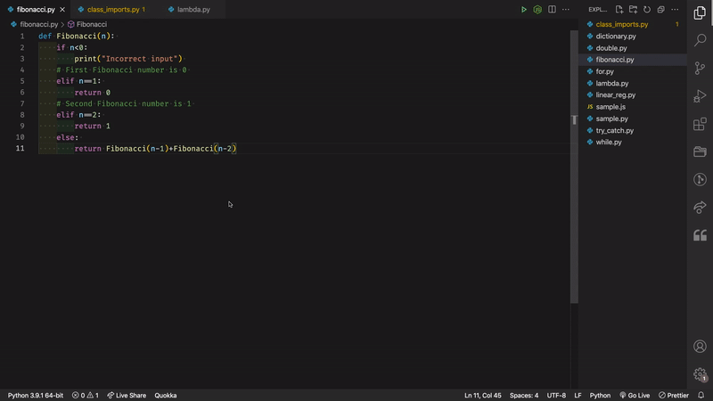

# Py to Js VS Code Extension

This extension is used to translate python to js files. The extension is enabled when the active file has a `.py` extension. 
The extension uses [py-to-js lib](https://github.com/kood-codes/py-to-js).

This extension is used as a demonstration for my blog [Translating programming languages like google translate](https://blog.kood.dev).



To install/uninstall the extention run the commands below:

```
code --install-extension vs-code-py-js-translator-1.0.0.vsix
```

```
code --uninstall-extension vs-code-py-js-translator-1.0.0.vsix
```
